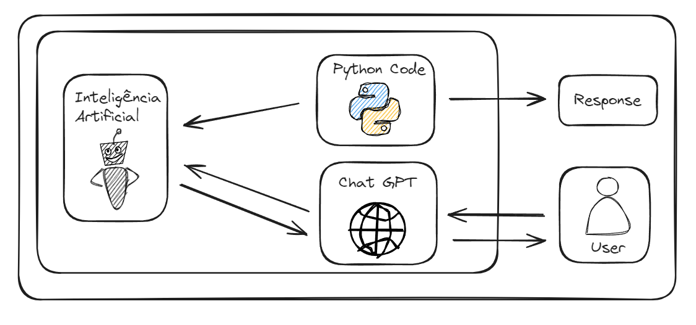
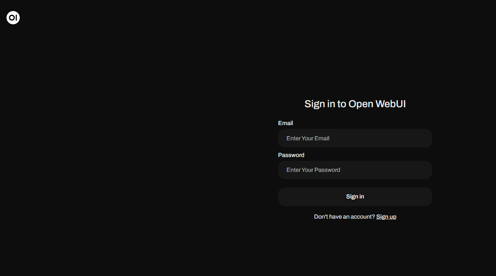
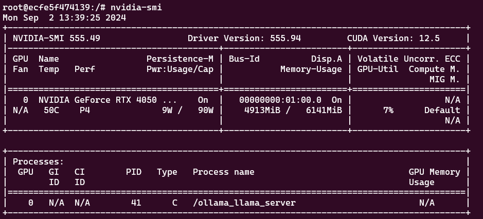

# Inteligência Artificial Rodando Local

Inteligência artificial rodando local no Docker.

Nessa Stack é possível utilizar um código da sua linguagem favorita e fazer requisição direta ao servidor da IA ou então utilizar a própria UI para digitar em linguagem natural e obter sua resposta, muito parecido com o Chat GPT.

No exemplo apresentado nesse repositório, vamos gerar a documentação em Markdown de um código Python com Inteligência Artificial.

## Video tutorial
https://www.youtube.com/watch?v=vZNPbaXR8j8

## Arquitetura


## Pré-requisitos
* Docker
* Python:3.10

## Config da minha máquina
System Manufacturer: HP

System Model: OMEN by HP Gaming Laptop 16-xd0xxx 

System Type: x64-based PC

Processor(s): AMD64 Family 25 Model 116 Stepping 1 AuthenticAMD ~3801 Mhz 

Total Physical Memory: 32 039 MB 

GPU: Nvidia Geforce RTX 4050

## Ferramentas utilizadas na Stack
Modelo: Ollama3

Interface Chat GPT: Open Web UI

Código Python: Requisição com resposta processada por IA

## Como instalar o Docker?
https://www.youtube.com/watch?v=pRFzDVn40rw&list=PLbPvnlmz6e_L_3Zw_fGtMcMY0eAOZnN-H

## Como instalar o Python?
https://www.python.org/downloads/

## Instalar pacotes NVIDIA
Configure repository
```
curl -fsSL https://nvidia.github.io/libnvidia-container/gpgkey \
    | sudo gpg --dearmor -o /usr/share/keyrings/nvidia-container-toolkit-keyring.gpg
curl -s -L https://nvidia.github.io/libnvidia-container/stable/deb/nvidia-container-toolkit.list \
    | sed 's#deb https://#deb [signed-by=/usr/share/keyrings/nvidia-container-toolkit-keyring.gpg] https://#g' \
    | sudo tee /etc/apt/sources.list.d/nvidia-container-toolkit.list
sudo apt-get update
```

## Install the NVIDIA Container Toolkit packages
```
sudo apt-get install -y nvidia-container-toolkit
```

## Configure Docker to use Nvidia driver
```
sudo nvidia-ctk runtime configure --runtime=docker
sudo systemctl restart docker
```

## Start container 
```
docker run -d --gpus=all -v ollama:/root/.ollama -p 11435:11434 --name ollama ollama/ollama:0.3.9
```

## Start UI - Chat GPT
```
docker run -d -p 7777:8080 -e OLLAMA_BASE_URL=http://0.0.0.0:11435 -v open-webui:/app/backend/data --name open-webui --restart always ghcr.io/open-webui/open-webui:main
```

## Como testar o uso da Stack?
### Uso como chat GPT
digite no navegador: ```localhost:7777```

Exemplo do chat GPT rodando local:


### Uso através de código Python
Crie o ambiente virtual
```
python3 -m venv venv
```

Ative o ambiente virtual (Linux)
```
source venv/bin/activate
```

Instale as libs necessárias
```
pip install -r requirements
```

Execute o código ```main.py```
```
python3 main.py
```

## Como verificar se o processamento está realizado pela GPU?
Primeiro você vai perceber que a performance está muito lenta, mas para validar, entre no container do Ollama.
```
docker ps
```

Entre pegue o id do container e entre nele
```
docker exec -it <id-container> /bin/bash
```

Dentro do container, execute o comando
```
nvidia-smi
```

Exemplo da GPU em execução:




## Caso de uso com Python
O código ```main.py``` vai gerar uma documentação do completa na pasta ```docs``` do código ```sample-code.py``` da pasta ```src```

## Conclusão
Parabéns! Sua IA local já está pronta o uso.

## Referências
https://hub.docker.com/r/ollama/ollama

https://docs.openwebui.com/

https://ollama.com/library

## Developer
| Desenvolvedor      | LinkedIn                                   | Email                        | Portfólio                              |
|--------------------|--------------------------------------------|------------------------------|----------------------------------------|
| Wallace Camargo    | [LinkedIn](https://www.linkedin.com/in/wallace-camargo-35b615171/) | wallacecpdg@gmail.com        | [Portfólio](https://wlcamargo.github.io/)   |


